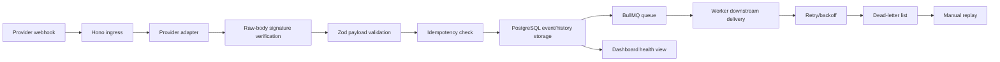

# webhook-reliability-integration-monitor

A local-first TypeScript portfolio project for demonstrating reliable webhook ingestion,
idempotent processing, retry handling, dead-letter recovery, and integration health monitoring.

Phase 1 defines pure core domain contracts in `packages/core`: provider IDs and metadata for
`stripe-sample`, `generic-http`, and `mock-crm`; Zod validation schemas for local sample payloads;
a provider-independent normalized event contract; retry policy helpers; provider adapters; and
fake/local-only Stripe-style HMAC signature verification. Phase 1 did not add database, queue,
worker, HTTP ingress, dashboard, simulator behavior, real provider API usage, or real credentials.

Phase 2 adds PostgreSQL-backed persistence in `packages/db` with Drizzle schema and migrations,
repository-layer behavior, idempotent event storage, status history, delivery attempts,
dead-letter records, manual replay audit records, local reset/seed scripts, and integration tests
against local PostgreSQL. There is still no HTTP ingress, Hono route, queue behavior, worker,
dashboard, simulator behavior, real provider API usage, or real credentials.

## Problem Statement

Business automations often depend on webhooks from payment providers, CRMs, scheduling tools, and
commerce platforms. Those events can arrive late, arrive more than once, fail signature validation,
or fail downstream delivery. A reliable webhook integration needs durable storage, idempotency,
retries, dead-letter handling, and operational visibility.

## Why Reliable Webhook Handling Matters for Business Automations

When webhook processing is unreliable, teams can miss paid invoices, duplicate customer updates,
lose fulfillment signals, or silently break revenue and support workflows. This project is planned
as a local demo of the safeguards that make webhook-driven automations observable and recoverable
before they are connected to real providers.

## Planned Architecture



Planned repository shape:

```text
apps/api        Hono API, webhook ingress, dashboard, health endpoints
apps/worker     BullMQ worker and retry processing
packages/core   provider contracts, schemas, signatures, idempotency/status model
packages/db     Drizzle schema, migrations, repository layer
packages/queue  queue names, job contracts, enqueue helpers, retry policy
tools/simulator local demo/simulator commands
infra           Docker Compose and local infrastructure files
docs            architecture notes, demo script, manual verification notes
```

## Local Prerequisites

- Windows 11 Pro with PowerShell
- Node.js `v24.16.0` or newer compatible version
- pnpm `11.7.0`
- Docker Desktop with Docker Compose

## Setup

```powershell
pnpm install
```

Copy `.env.example` to `.env` only when a future phase requires local environment values. The
example file uses fake local-only values.

## Phase 2 Local Database

Phase 2 stores canonical webhook state in PostgreSQL through Drizzle. The generated migration
creates these tables:

- `webhook_events`
- `event_status_history`
- `delivery_attempts`
- `dead_letter_events`
- `manual_replays`

The main idempotency guarantee is the unique database constraint on
`(provider_id, external_event_id)` in `webhook_events`. Reset and seed scripts are local-only:
they refuse destructive cleanup when `DATABASE_URL` does not point to a known local host and local
demo/test database name. Seed data is fake and deterministic. Use `pnpm db:reset` when you need to
truncate only application tables while preserving Drizzle migration metadata.

Run Phase 2 commands from the repository root:

```powershell
docker compose -f .\infra\docker-compose.yml up -d postgres
pnpm install
pnpm db:generate
pnpm db:migrate
pnpm db:seed
pnpm test -- --run
pnpm lint
pnpm typecheck
docker compose -f .\infra\docker-compose.yml ps
git status --short
```

`pnpm format:check` is also part of the repository quality gate. `pnpm db:studio` is available for
manual inspection, but it is not a blocking validation command because it may keep a process open.

## Phase 0 Validation Commands

Run from the repository root:

```powershell
pnpm format:check
pnpm lint
pnpm typecheck
pnpm test
docker compose -f .\infra\docker-compose.yml up -d
docker compose -f .\infra\docker-compose.yml ps
docker compose -f .\infra\docker-compose.yml down
git status --short
```

Equivalent package scripts are available for Docker:

```powershell
pnpm docker:up
pnpm docker:ps
pnpm docker:down
```

## Provider API Policy

Real Stripe, Shopify, Calendly, HubSpot, CRM, or paid provider APIs are not used by default. Future
phases should use mock/local-only values unless real API usage is explicitly approved.

## Codex Workflow Policy

Codex may inspect, edit, and validate local files in this repository, but must not commit, push,
create tags, rewrite Git history, or modify Git remotes. The user manually commits and pushes.
