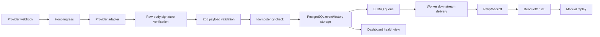

# webhook-reliability-integration-monitor

A local-first TypeScript portfolio project for demonstrating reliable webhook ingestion,
idempotent processing, retry handling, dead-letter recovery, and integration health monitoring.

Phase 1 defines pure core domain contracts in `packages/core`: provider IDs and metadata for
`stripe-sample`, `generic-http`, and `mock-crm`; Zod validation schemas for local sample payloads;
a provider-independent normalized event contract; retry policy helpers; provider adapters; and
fake/local-only Stripe-style HMAC signature verification. Phase 1 did not add database, queue,
worker, HTTP ingress, dashboard, simulator behavior, real provider API usage, or real credentials.

Phase 2 adds PostgreSQL-backed persistence in `packages/db` with Drizzle schema and migrations,
repository-layer behavior, idempotent event storage, status history, delivery attempts,
dead-letter records, manual replay audit records, local reset/seed scripts, and integration tests
against local PostgreSQL. At the end of Phase 2 there was still no HTTP ingress, Hono route, queue
behavior, worker, dashboard, simulator behavior, real provider API usage, or real credentials.

Phase 3 adds a local Hono webhook ingress API in `apps/api`: `GET /healthz` and
`POST /webhooks/:provider` for `stripe-sample`, `generic-http`, and `mock-crm`. The ingress reads
the raw request body before parsing JSON, verifies fake/local Stripe-style HMAC signatures for
`stripe-sample`, validates payloads with the Phase 1 Zod adapters, persists accepted and rejected
events through the Phase 2 database repositories, enforces provider/external-event idempotency, and
calls a dependency-injected delivery queue placeholder only for newly accepted events. Phase 3 does
not add BullMQ, Redis queue behavior, worker processing, retry execution, dashboard pages,
simulator commands, real provider APIs, or provider SDKs.

Phase 4 replaces the queue placeholder with BullMQ-backed delivery jobs in `packages/queue` and
adds `apps/worker` for local mock downstream processing. The worker records delivery attempts,
updates event status history, retries retryable failures with capped exponential backoff, marks
successful events as delivered, and creates dead-letter records after retry exhaustion or permanent
mock failures. Phase 4 still does not add dashboard pages, manual replay UI, simulator commands,
provider SDKs, real provider calls, paid API usage, GitHub Actions, or app containers.

## Problem Statement

Business automations often depend on webhooks from payment providers, CRMs, scheduling tools, and
commerce platforms. Those events can arrive late, arrive more than once, fail signature validation,
or fail downstream delivery. A reliable webhook integration needs durable storage, idempotency,
retries, dead-letter handling, and operational visibility.

## Why Reliable Webhook Handling Matters for Business Automations

When webhook processing is unreliable, teams can miss paid invoices, duplicate customer updates,
lose fulfillment signals, or silently break revenue and support workflows. This project is planned
as a local demo of the safeguards that make webhook-driven automations observable and recoverable
before they are connected to real providers.

## Planned Architecture



Planned repository shape:

```text
apps/api        Hono API, webhook ingress, dashboard, health endpoints
apps/worker     BullMQ worker and retry processing
packages/core   provider contracts, schemas, signatures, idempotency/status model
packages/db     Drizzle schema, migrations, repository layer
packages/queue  queue names, job contracts, enqueue helpers, retry policy
tools/simulator local demo/simulator commands
infra           Docker Compose and local infrastructure files
docs            architecture notes, demo script, manual verification notes
```

## Local Prerequisites

- Windows 11 Pro with PowerShell
- Node.js `v24.16.0` or newer compatible version
- pnpm `11.7.0`
- Docker Desktop with Docker Compose

## Setup

```powershell
pnpm install
```

Copy `.env.example` to `.env` only when a future phase requires local environment values. The
example file uses fake local-only values.

## Phase 2 Local Database

Phase 2 stores canonical webhook state in PostgreSQL through Drizzle. The generated migration
creates these tables:

- `webhook_events`
- `event_status_history`
- `delivery_attempts`
- `dead_letter_events`
- `manual_replays`

The main idempotency guarantee is the unique database constraint on
`(provider_id, external_event_id)` in `webhook_events`. Reset and seed scripts are local-only:
they refuse destructive cleanup when `DATABASE_URL` does not point to a known local host and local
demo/test database name. Seed data is fake and deterministic. Use `pnpm db:reset` when you need to
truncate only application tables while preserving Drizzle migration metadata.

Run Phase 2 commands from the repository root:

```powershell
docker compose -f .\infra\docker-compose.yml up -d postgres
pnpm install
pnpm db:generate
pnpm db:migrate
pnpm db:seed
pnpm test -- --run
pnpm lint
pnpm typecheck
docker compose -f .\infra\docker-compose.yml ps
git status --short
```

`pnpm format:check` is also part of the repository quality gate. `pnpm db:studio` is available for
manual inspection, but it is not a blocking validation command because it may keep a process open.

## Phase 3 Webhook Ingress API

Run the API locally after starting Postgres and applying migrations:

```powershell
docker compose -f .\infra\docker-compose.yml up -d postgres redis
pnpm install
pnpm db:migrate
pnpm dev:api
```

`pnpm dev:api` is a long-running local server command. In another PowerShell session, send a valid
generic webhook:

```powershell
$genericBody = @{
  eventId = "generic-manual-1"
  eventType = "order.fulfilled"
  occurredAt = "2026-06-20T12:00:00.000Z"
  source = "manual-local"
  idempotencyKey = "generic-manual-1"
  payload = @{
    orderId = "order_manual_123"
    total = 2499
    currency = "usd"
  }
} | ConvertTo-Json -Depth 6 -Compress

Invoke-RestMethod `
  -Method Post `
  -Uri "http://localhost:3000/webhooks/generic-http" `
  -ContentType "application/json" `
  -Body $genericBody
```

Send the same `$genericBody` again to verify the duplicate response. Send an invalid payload:

```powershell
$invalidBody = @{
  eventId = "generic-invalid-manual-1"
  occurredAt = "2026-06-20T12:00:00.000Z"
  payload = @{}
} | ConvertTo-Json -Depth 4 -Compress

Invoke-RestMethod `
  -Method Post `
  -Uri "http://localhost:3000/webhooks/generic-http" `
  -ContentType "application/json" `
  -Body $invalidBody
```

Send a signed fake/local Stripe-style webhook:

```powershell
$timestamp = [DateTimeOffset]::UtcNow.ToUnixTimeSeconds()
$stripeBody = @{
  id = "evt_manual_payment_succeeded"
  object = "event"
  type = "payment_intent.succeeded"
  created = $timestamp
  livemode = $false
  data = @{
    object = @{
      id = "pi_manual_123"
      object = "payment_intent"
      amount = 2499
      currency = "usd"
    }
  }
} | ConvertTo-Json -Depth 8 -Compress

$secret = "whsec_local_test_secret"
$hmac = [System.Security.Cryptography.HMACSHA256]::new(
  [System.Text.Encoding]::UTF8.GetBytes($secret)
)
$signatureBytes = $hmac.ComputeHash(
  [System.Text.Encoding]::UTF8.GetBytes("${timestamp}.${stripeBody}")
)
$signature = -join ($signatureBytes | ForEach-Object { $_.ToString("x2") })
$hmac.Dispose()

Invoke-RestMethod `
  -Method Post `
  -Uri "http://localhost:3000/webhooks/stripe-sample" `
  -ContentType "application/json" `
  -Headers @{ "stripe-signature" = "t=$timestamp,v1=$signature" } `
  -Body $stripeBody
```

Send the same `$stripeBody` with `-Headers @{ "stripe-signature" = "t=$timestamp,v1=deadbeef" }`
to verify invalid-signature rejection and persisted audit history.

Phase 3 validation commands:

```powershell
docker compose -f .\infra\docker-compose.yml up -d postgres redis
pnpm install
pnpm db:migrate
pnpm test -- --run
pnpm lint
pnpm typecheck
git status --short
```

## Phase 4 Queue, Worker, Retry, And Dead Letter

Phase 4 requires local PostgreSQL and Redis. `packages/queue` owns the BullMQ queue named
`webhook-delivery`, delivery job validation, stable job ids in the form `delivery-<eventId>`, Redis
connection helpers, and capped exponential retry options. `apps/api` enqueues one delivery job for
each newly accepted webhook event; duplicate events and rejected webhooks do not enqueue jobs.

`apps/worker` consumes delivery jobs and calls a deterministic local mock downstream client. The
mock behavior is controlled by `generic-http` payload fields such as
`payload.deliveryBehavior`. Supported values are `success`, `fail-once-then-success`,
`fail-twice-then-success`, `always-retryable-fail`, and `permanent-fail`.

### Phase 4 local manual QA

Start the local infrastructure, migrate the database, and run the API from the repository root:

```powershell
docker compose -f .\infra\docker-compose.yml up -d postgres redis
pnpm db:migrate
pnpm dev:api
```

`pnpm dev:api` is long-running. In a second PowerShell terminal, start the worker:

```powershell
pnpm dev:worker
```

`pnpm dev:worker` is also long-running. In a third PowerShell terminal, send the manual QA
webhooks. If you have already sent these exact event IDs, either change all three `eventId` and
`idempotencyKey` values to new unique strings, or intentionally reset local app data first with the
local-only `pnpm db:reset` command.

Send a successful delivery scenario:

```powershell
$successBody = @{
  eventId = "generic-phase4-success-1"
  eventType = "order.fulfilled"
  occurredAt = "2026-06-20T12:00:00.000Z"
  source = "manual-local"
  idempotencyKey = "generic-phase4-success-1"
  payload = @{
    orderId = "order_phase4_success_123"
    deliveryBehavior = "success"
  }
} | ConvertTo-Json -Depth 6 -Compress

Invoke-RestMethod `
  -Method Post `
  -Uri "http://localhost:3000/webhooks/generic-http" `
  -ContentType "application/json" `
  -Body $successBody
```

Send a retry-then-success scenario. The payload shape matches the `generic-http` test fixture, with
the mock worker behavior selected by `payload.deliveryBehavior`:

```powershell
$retryBody = @{
  eventId = "generic-phase4-retry-1"
  eventType = "order.fulfilled"
  occurredAt = "2026-06-20T12:00:00.000Z"
  source = "manual-local"
  idempotencyKey = "generic-phase4-retry-1"
  payload = @{
    orderId = "order_phase4_retry_123"
    deliveryBehavior = "fail-once-then-success"
  }
} | ConvertTo-Json -Depth 6 -Compress

Invoke-RestMethod `
  -Method Post `
  -Uri "http://localhost:3000/webhooks/generic-http" `
  -ContentType "application/json" `
  -Body $retryBody
```

Send a permanent-failure dead-letter scenario:

```powershell
$deadLetterBody = @{
  eventId = "generic-phase4-dead-letter-1"
  eventType = "order.fulfilled"
  occurredAt = "2026-06-20T12:00:00.000Z"
  source = "manual-local"
  idempotencyKey = "generic-phase4-dead-letter-1"
  payload = @{
    orderId = "order_phase4_dead_letter_123"
    deliveryBehavior = "permanent-fail"
  }
} | ConvertTo-Json -Depth 6 -Compress

Invoke-RestMethod `
  -Method Post `
  -Uri "http://localhost:3000/webhooks/generic-http" `
  -ContentType "application/json" `
  -Body $deadLetterBody
```

To verify retry exhaustion instead of a permanent failure, send the same dead-letter payload with a
new `eventId` / `idempotencyKey` and `deliveryBehavior = "always-retryable-fail"`. With the
`.env.example` defaults, the worker uses three max attempts and schedules the first retry after about
one second.

After sending the webhooks, wait a few seconds for the worker to finish retry processing, then inspect
the local database through the existing Postgres container:

```powershell
docker compose -f .\infra\docker-compose.yml exec -T postgres psql -U webhook_monitor -d webhook_monitor -c "select external_event_id, current_status, last_successful_at from webhook_events where external_event_id in ('generic-phase4-success-1', 'generic-phase4-retry-1', 'generic-phase4-dead-letter-1') order by external_event_id;"

docker compose -f .\infra\docker-compose.yml exec -T postgres psql -U webhook_monitor -d webhook_monitor -c "select e.external_event_id, a.attempt_number, a.status, a.http_status_code, a.error_code from delivery_attempts a join webhook_events e on e.id = a.event_id where e.external_event_id in ('generic-phase4-success-1', 'generic-phase4-retry-1', 'generic-phase4-dead-letter-1') order by e.external_event_id, a.attempt_number;"

docker compose -f .\infra\docker-compose.yml exec -T postgres psql -U webhook_monitor -d webhook_monitor -c "select e.external_event_id, h.from_status, h.to_status, h.reason_code from event_status_history h join webhook_events e on e.id = h.event_id where e.external_event_id in ('generic-phase4-success-1', 'generic-phase4-retry-1', 'generic-phase4-dead-letter-1') order by e.external_event_id, h.created_at;"

docker compose -f .\infra\docker-compose.yml exec -T postgres psql -U webhook_monitor -d webhook_monitor -c "select e.external_event_id, d.reason_code, d.final_attempt_number from dead_letter_events d join webhook_events e on e.id = d.event_id where e.external_event_id in ('generic-phase4-success-1', 'generic-phase4-retry-1', 'generic-phase4-dead-letter-1') order by e.external_event_id;"
```

Expected manual QA results:

| Scenario                 | Expected event status | Expected delivery attempts                                    | Expected dead-letter row                                           |
| ------------------------ | --------------------- | ------------------------------------------------------------- | ------------------------------------------------------------------ |
| success                  | `delivered`           | attempt `1` is `succeeded`                                    | none                                                               |
| retry then success       | `delivered`           | attempt `1` is `failed_retryable`; attempt `2` is `succeeded` | none                                                               |
| permanent failure        | `dead_lettered`       | attempt `1` is `failed_permanent`                             | `reason_code=permanent_delivery_failure`, `final_attempt_number=1` |
| retry exhaustion variant | `dead_lettered`       | attempts `1..3` are `failed_retryable`                        | `reason_code=max_attempts_exhausted`, `final_attempt_number=3`     |

There is no dedicated simulator CLI or fully automated manual-QA helper yet. Phase 4 E2E verification
is currently documented as manual PowerShell requests plus SQL inspection. `pnpm db:studio` remains
available for interactive inspection, but it is not a blocking validation command because it keeps a
long-running process open. The worker handles `SIGINT` and `SIGTERM` by closing the BullMQ worker,
Redis connection, and database client.

Phase 4 validation commands:

```powershell
docker compose -f .\infra\docker-compose.yml up -d postgres redis
pnpm install
pnpm db:generate
pnpm db:migrate
pnpm test -- --run
pnpm format:check
pnpm lint
pnpm typecheck
git status --short
```

## Phase 0 Validation Commands

Run from the repository root:

```powershell
pnpm format:check
pnpm lint
pnpm typecheck
pnpm test
docker compose -f .\infra\docker-compose.yml up -d
docker compose -f .\infra\docker-compose.yml ps
docker compose -f .\infra\docker-compose.yml down
git status --short
```

Equivalent package scripts are available for Docker:

```powershell
pnpm docker:up
pnpm docker:ps
pnpm docker:down
```

## Provider API Policy

Real Stripe, Shopify, Calendly, HubSpot, CRM, or paid provider APIs are not used by default. Future
phases should use mock/local-only values unless real API usage is explicitly approved.

## Codex Workflow Policy

Codex may inspect, edit, and validate local files in this repository, but must not commit, push,
create tags, rewrite Git history, or modify Git remotes. The user manually commits and pushes.
