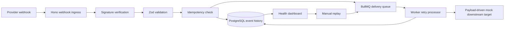

# Webhook Reliability Integration Monitor

A lightweight local middleware service that receives webhook events, validates payloads, verifies
fake Stripe-style signatures, stores event history, prevents duplicate processing, retries failed
deliveries, dead-letters unrecoverable events, and exposes a local server-rendered health dashboard.

This is a portfolio project for business automation reliability. It demonstrates production-style
webhook patterns locally without real provider credentials, paid APIs, public tunnels, deployment, or
provider SDKs.

## Client Problem

Webhook-based automations often fail silently. A SaaS operator may depend on payment, CRM,
scheduling, commerce, and support webhooks, but those systems can send bad or repeated events, time
out during delivery, or fail while a downstream system is unavailable.

Common failure modes:

- Duplicate events
- Invalid payloads
- Invalid signatures
- Timeouts
- Downstream API outages
- Expired credentials
- Missing retry visibility

Business impact:

- Lost orders
- Stale CRM records
- Missed notifications
- Broken billing workflows
- Manual reconciliation work

## Why Reliable Webhook Handling Matters For Business Automations

Business automations depend on external systems that are outside the operator's direct control. A
payment event, CRM update, booking notification, or fulfillment signal may be valid, duplicated,
malformed, late, or temporarily undeliverable. Reliable webhook middleware turns those uncertain
inputs into an auditable workflow: validate trust, preserve history, process idempotently, retry
temporary failures, dead-letter unrecoverable events, and give operators a dashboard for recovery.

## Fake Client Scenario

Client: SaaS operator with several webhook-based integrations.

Problem: Webhook events are sometimes duplicated or fail silently. The team has no clear retry
mechanism, no event history, and no dashboard for integration health.

Solution: A webhook middleware and health monitor that makes integrations observable and retryable
before events are handed to downstream business systems.

## What This Project Demonstrates

- Production-style webhook ingestion
- Zod payload validation
- Stripe-style HMAC signature verification in fake/local mode
- Idempotency handling by provider and external event ID
- PostgreSQL event history
- BullMQ/Redis retry queue
- Worker-based downstream processing
- Exponential retry/backoff
- Dead-letter handling
- Manual replay
- Server-rendered health dashboard
- Local webhook simulator
- Environment validation
- Structured logging
- Correlation IDs
- Readiness checks
- Payload-size limits
- In-memory local rate limiting
- Safe error responses
- Secret redaction

## Architecture

The API accepts webhook requests through Hono, verifies provider-specific trust requirements, parses
and validates payloads with Zod, stores every accepted or rejected event in PostgreSQL, and enqueues
new accepted events to BullMQ. The worker consumes delivery jobs from Redis, uses a payload-driven
local mock downstream client, records delivery attempts, retries retryable failures, creates
dead-letter records, and lets the dashboard read health state from PostgreSQL.



Plain-text flow:

```text
provider webhook -> ingress -> validation -> queue -> worker -> mock target -> dashboard
```

Detailed lifecycle notes are in [docs/architecture.md](docs/architecture.md).

## Repository Structure

```text
apps/api         Hono API, webhook ingress, health/readiness routes, dashboard HTML and JSON routes
apps/worker      BullMQ worker runtime, retry processing, mock downstream delivery simulation
packages/core    Provider contracts, Zod schemas, status model, retry policy, signatures, logging
packages/db      Drizzle schema, migrations, database client, repositories, reset/seed scripts
packages/queue   Queue names, delivery job contracts, Redis helpers, BullMQ enqueue/worker helpers
tools/simulator  Local webhook simulator scenarios and fake provider payloads
infra            Docker Compose services for local PostgreSQL and Redis
docs             Architecture, demo, failure scenarios, screenshots, verification, troubleshooting
```

## Tech Stack

- Node.js
- TypeScript
- pnpm workspaces
- Hono
- Zod
- PostgreSQL
- Redis
- BullMQ
- Drizzle ORM and Drizzle Kit
- Vitest
- Docker Compose
- PowerShell-friendly local workflow

## Prerequisites

- Windows 11 Pro
- PowerShell
- Node.js `24.16.0` or newer
- pnpm `11.7.0` or newer, through Corepack or an installed pnpm
- Docker Desktop
- Git
- VS Code, optional

Check local tooling:

```powershell
node --version
pnpm --version
docker --version
docker compose version
git --version
```

## Local Setup

Run from the project root:

```powershell
Set-Location "C:\Users\alex\Documents\Coding Projects\Portfolio Projects\webhook-reliability-integration-monitor"
pnpm install
Copy-Item .env.example .env
docker compose -f .\infra\docker-compose.yml up -d postgres redis
pnpm db:migrate
```

The API, worker, database scripts, queue reset script, and simulator read `.env` when present. Local
development commands also fall back to `.env.example` for fake local values, but copying `.env` makes
the workflow explicit and closer to a clean-clone setup.

## Environment Variables

`.env.example` contains fake local-only values. No real provider credentials are required.

Important values:

- `DATABASE_URL` targets local Docker PostgreSQL.
- `REDIS_URL` targets local Docker Redis.
- `STRIPE_SAMPLE_WEBHOOK_SECRET` is a fake local signing secret for the sample Stripe-style provider.
- `MOCK_DOWNSTREAM_MODE=payload-driven` tells the worker to simulate downstream behavior from the
  event payload.
- `SIMULATOR_API_BASE_URL=http://localhost:3000` points the simulator at the local API.

Do not commit real secrets. `.env` is ignored by Git. Production deployment would need real secret
management, authentication, authorization, TLS, and environment-specific configuration.

## Database Commands

Run these from the repository root:

| Command            | What it does                                        | Safety                                             |
| ------------------ | --------------------------------------------------- | -------------------------------------------------- |
| `pnpm db:generate` | Generates Drizzle migrations from schema changes    | Development command; may create migration files    |
| `pnpm db:migrate`  | Applies existing migrations to the configured DB    | Safe for local setup when `DATABASE_URL` is local  |
| `pnpm db:reset`    | Truncates application tables, preserving migrations | Destructive local-only reset with DB target checks |
| `pnpm db:seed`     | Resets and inserts fake deterministic demo data     | Destructive local-only seed                        |
| `pnpm db:studio`   | Opens Drizzle Studio                                | Long-running inspection command                    |
| `pnpm queue:reset` | Clears the local BullMQ delivery queue              | Destructive local-only Redis target checks         |
| `pnpm demo:reset`  | Runs `db:reset` and `queue:reset`                   | Destructive local-only demo reset                  |
| `pnpm demo:seed`   | Runs `db:seed`                                      | Destructive local-only demo seed                   |

## Running The App Locally

Use three PowerShell terminals.

Terminal 1, API:

```powershell
Set-Location "C:\Users\alex\Documents\Coding Projects\Portfolio Projects\webhook-reliability-integration-monitor"
pnpm dev:api
```

Terminal 2, worker:

```powershell
Set-Location "C:\Users\alex\Documents\Coding Projects\Portfolio Projects\webhook-reliability-integration-monitor"
pnpm dev:worker
```

Terminal 3, simulator:

```powershell
Set-Location "C:\Users\alex\Documents\Coding Projects\Portfolio Projects\webhook-reliability-integration-monitor"
pnpm simulator:success
```

`pnpm dev:api` and `pnpm dev:worker` are long-running commands. The default API URL is
`http://localhost:3000`, and the default dashboard URL is `http://localhost:3000/dashboard`.

The dashboard is local-demo only. Do not expose it publicly without adding production authentication,
authorization, CSRF protection, and deployment hardening.

## Health And Readiness

```powershell
Invoke-RestMethod -Method Get -Uri "http://localhost:3000/healthz"
Invoke-RestMethod -Method Get -Uri "http://localhost:3000/readyz"
```

- `GET /healthz`: process is alive.
- `GET /readyz`: dependencies such as PostgreSQL and Redis are available.

`/readyz` returns `503` with safe dependency status when the database or queue dependency is
unavailable.

## Webhook Endpoints

The implemented route is:

```text
POST /webhooks/:provider
```

Concrete local provider paths:

- `POST /webhooks/stripe-sample`
- `POST /webhooks/generic-http`
- `POST /webhooks/mock-crm`

Behavior:

- `stripe-sample` requires a fake/local Stripe-style `stripe-signature` HMAC over the raw body.
- `generic-http` validates a generic integration event shape.
- `mock-crm` validates a sample CRM event shape.
- Invalid signatures return `401`, persist `rejected_invalid_signature`, and do not enqueue.
- Invalid JSON or invalid payloads return `400`, persist `rejected_invalid_payload`, and do not
  enqueue.
- Duplicate provider/external event IDs return success with duplicate handling and append
  `duplicate_ignored` history without creating another delivery job.
- Accepted new events record `received`, `validated`, and `queued` history, then the worker records
  processing, retry, delivery, or dead-letter history.

No real Stripe, Shopify, Calendly, HubSpot, CRM, or paid provider APIs are called.

## Dashboard Routes

HTML routes:

- `GET /dashboard`
- `GET /dashboard/events`
- `GET /dashboard/events/:eventId`
- `GET /dashboard/dead-letter`
- `POST /dashboard/events/:eventId/replay`

JSON routes:

- `GET /api/dashboard/summary`
- `GET /api/dashboard/events`
- `GET /api/dashboard/events/:eventId`
- `GET /api/dashboard/dead-letter`
- `POST /api/dashboard/events/:eventId/replay`

Dashboard summary metrics:

- Event volume
- Success rate
- Failed events
- Retry count
- Dead-letter count
- Last successful event

Manual replay is allowed for `dead_lettered` and `failed_retryable` events. It creates a manual
replay audit row and queues a replay-specific delivery job. Replay does not weaken normal webhook
idempotency.

## Simulator Scenarios

Run after Docker services, migrations, API, and worker are running. `pnpm simulator:all` expects a
clean demo state; use `pnpm demo:reset` first when rerunning the full sequence.

| Command                            | Sends                             | Expected API result                | Expected worker/dashboard result                     |
| ---------------------------------- | --------------------------------- | ---------------------------------- | ---------------------------------------------------- |
| `pnpm simulator:stripe-valid`      | Signed `stripe-sample` event      | `200`, `queued`                    | Delivered event visible in dashboard                 |
| `pnpm simulator:success`           | `generic-http` success event      | `200`, `queued`                    | Delivered event with one successful attempt          |
| `pnpm simulator:duplicate`         | Same generic event twice          | First queued, second duplicate     | One event, duplicate audit history, no second job    |
| `pnpm simulator:invalid-signature` | Bad signed Stripe-style event     | `401`, invalid signature           | Rejected event, no delivery attempt                  |
| `pnpm simulator:invalid-payload`   | Malformed generic payload         | `400`, invalid payload             | Rejected event, no delivery attempt                  |
| `pnpm simulator:mock-crm-success`  | `mock-crm` success event          | `200`, `queued`                    | Delivered CRM event                                  |
| `pnpm simulator:retry-success`     | Retryable failure then success    | `200`, `queued`                    | Failed attempt, retry, then delivered                |
| `pnpm simulator:dead-letter`       | Always retryable failure          | `200`, `queued`                    | Retries exhausted, event dead-lettered               |
| `pnpm simulator:permanent-failure` | Non-retryable downstream failure  | `200`, `queued`                    | Dead-lettered without unnecessary retries            |
| `pnpm simulator:manual-replay`     | Dead-letter then replayable event | `200`, replay queued through API   | Replay audit row, replay job, delivered after replay |
| `pnpm simulator:all`               | Full local demo sequence          | Runs all scenarios after preflight | Dashboard shows success, retry, reject, dead-letter  |

Detailed scenario notes are in [docs/failure-scenarios.md](docs/failure-scenarios.md).

## Demo Walkthrough

Use this clean sequence for a portfolio demo:

```powershell
Set-Location "C:\Users\alex\Documents\Coding Projects\Portfolio Projects\webhook-reliability-integration-monitor"
pnpm install
Copy-Item .env.example .env
docker compose -f .\infra\docker-compose.yml up -d postgres redis
pnpm db:migrate
pnpm demo:reset
```

Terminal 1:

```powershell
pnpm dev:api
```

Terminal 2:

```powershell
pnpm dev:worker
```

Open:

```text
http://localhost:3000/dashboard
```

Terminal 3:

```powershell
pnpm simulator:success
pnpm simulator:duplicate
pnpm simulator:invalid-signature
pnpm simulator:invalid-payload
pnpm simulator:retry-success
pnpm simulator:dead-letter
pnpm simulator:manual-replay
```

During the demo:

1. Show the clean dashboard.
2. Run the success scenario.
3. Run the duplicate scenario.
4. Run the invalid signature scenario.
5. Run the invalid payload scenario.
6. Run the retry success scenario.
7. Run the dead-letter scenario.
8. Run the manual replay scenario.
9. Open an event detail page and show status history.
10. Return to the dashboard summary and show metric changes.

The demo video script is in [docs/demo-video-script.md](docs/demo-video-script.md), and the
screenshot checklist is in [docs/screenshot-checklist.md](docs/screenshot-checklist.md).

## Validation Commands

Standard local quality gate:

```powershell
pnpm format:check
pnpm lint
pnpm typecheck
pnpm test -- --run
git status --short
```

Infrastructure checks:

```powershell
docker compose -f .\infra\docker-compose.yml up -d postgres redis
docker compose -f .\infra\docker-compose.yml ps
```

Equivalent Docker package scripts:

```powershell
pnpm docker:up
pnpm docker:ps
pnpm docker:down
```

## Package Scripts

Common root scripts:

| Script                      | Purpose                                 |
| --------------------------- | --------------------------------------- |
| `pnpm format`               | Format repository files with Prettier   |
| `pnpm format:check`         | Check Prettier formatting               |
| `pnpm lint`                 | Run ESLint                              |
| `pnpm typecheck`            | Run TypeScript project type checking    |
| `pnpm test`                 | Run Vitest                              |
| `pnpm dev:api`              | Start the long-running local Hono API   |
| `pnpm dev:worker`           | Start the long-running BullMQ worker    |
| `pnpm db:generate`          | Generate Drizzle migrations             |
| `pnpm db:migrate`           | Apply database migrations               |
| `pnpm db:reset`             | Reset local application tables          |
| `pnpm db:seed`              | Seed fake local demo data               |
| `pnpm db:studio`            | Open Drizzle Studio                     |
| `pnpm queue:reset`          | Clear the local delivery queue          |
| `pnpm demo:reset`           | Reset local DB tables and queue         |
| `pnpm demo:seed`            | Seed fake local demo data               |
| `pnpm demo:run`             | Run `simulator:all`                     |
| `pnpm docker:up`            | Start Docker Compose services           |
| `pnpm docker:ps`            | Show Docker Compose service status      |
| `pnpm docker:down`          | Stop Docker Compose services            |
| `pnpm simulator:<scenario>` | Run a specific local simulator scenario |
| `pnpm simulator:all`        | Run the full local simulator sequence   |

## Troubleshooting

Detailed troubleshooting is in [docs/troubleshooting.md](docs/troubleshooting.md).

| Issue                                          | Likely cause                                       | Check                                                    | Fix                                                               |
| ---------------------------------------------- | -------------------------------------------------- | -------------------------------------------------------- | ----------------------------------------------------------------- |
| Docker is not running                          | Docker Desktop is stopped                          | `docker compose -f .\infra\docker-compose.yml ps`        | Start Docker Desktop                                              |
| Postgres port `5432` is in use                 | Another local Postgres process owns the port       | `docker compose -f .\infra\docker-compose.yml ps`        | Stop the other service or change local Docker ports intentionally |
| Redis port `6379` is in use                    | Another Redis process owns the port                | `docker compose -f .\infra\docker-compose.yml ps`        | Stop the other service or change local Docker ports intentionally |
| `pnpm` is unavailable                          | Corepack/pnpm is not enabled                       | `pnpm --version`                                         | Enable Corepack or install pnpm                                   |
| Migrations fail                                | Postgres is down or `DATABASE_URL` is wrong        | `docker compose -f .\infra\docker-compose.yml ps`        | Start Postgres and use `.env.example` local values                |
| API cannot connect to database                 | Postgres is unavailable or migrations were skipped | `Invoke-RestMethod -Uri "http://localhost:3000/readyz"`  | Start Postgres and run `pnpm db:migrate`                          |
| Worker cannot connect to Redis                 | Redis is unavailable or `REDIS_URL` is wrong       | `docker compose -f .\infra\docker-compose.yml ps`        | Start Redis and restart `pnpm dev:worker`                         |
| Simulator says API is unreachable              | API is not running or wrong base URL               | `Invoke-RestMethod -Uri "http://localhost:3000/healthz"` | Start `pnpm dev:api`                                              |
| Dashboard has no data                          | No events were sent or DB was reset                | Open `/dashboard/events`                                 | Run `pnpm simulator:success`                                      |
| Retry/dead-letter scenario does not finish     | Worker is not running or queue is backed up        | Check worker terminal logs                               | Start/restart `pnpm dev:worker`                                   |
| Rate limit returns `429` during repeated tests | Local in-memory rate limit was exceeded            | Response includes `Retry-After`                          | Wait for the window or restart API for demo use                   |
| Payload-size limit returns `413`               | Body exceeds `WEBHOOK_MAX_BODY_BYTES`              | Check payload size                                       | Use a smaller payload or intentionally raise the local limit      |
| Invalid signature occurs unexpectedly          | Raw body or signing secret changed                 | Compare API and simulator `.env` values                  | Restart API after setting the fake secret                         |

## Technical Tradeoffs

- Hono server-rendered dashboard instead of Next.js keeps scope focused on backend reliability.
- Fake provider adapters avoid real provider credentials and keep the demo repeatable.
- The worker uses a local payload-driven mock downstream target instead of paid or real APIs.
- PostgreSQL and Redis run through Docker Compose for realistic local persistence and queue behavior.
- BullMQ retries replace hand-rolled retry loops.
- In-memory rate limiting is local/demo only, not distributed production rate limiting.
- The dashboard has no production authentication yet.
- There is no hosted deployment yet.
- There is no external observability vendor yet.

## Future Improvements

- Production authentication for the dashboard
- Real provider adapters for Stripe, Shopify, HubSpot, and similar systems
- Provider secret rotation
- Multi-tenant integration accounts
- OpenTelemetry tracing
- Hosted deployment
- GitHub Actions CI
- Richer dashboard filters and charts
- Email or Slack alerts for dead-letter events
- Distributed rate limiting
- Webhook replay authorization and audit controls
- Payload redaction or encryption for sensitive data

## Security And Secrets

- All credentials in this repository are fake local values.
- No real provider API calls are made by default.
- Secrets must not be committed.
- `.env` is ignored by Git.
- `.env.example` is safe and fake.
- The dashboard is local-demo only unless production authentication is added.

## Provider API Policy

Real Stripe, Shopify, Calendly, HubSpot, CRM, or paid provider APIs are not used by default. Future
work should keep mock/local mode unless real API usage is explicitly approved.

## Codex Workflow Policy

Codex may inspect, edit, and validate local files in this repository, but must not commit, push,
create tags, rewrite Git history, or modify Git remotes. The user manually commits and pushes.
