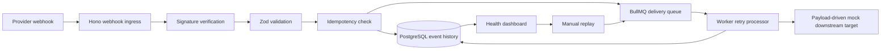

# Architecture

## Overview

Webhook Reliability Integration Monitor is a local-first middleware service for receiving,
validating, storing, retrying, and replaying webhook events. It is designed as a business automation
reliability case study, not as a production deployment.

The implemented flow is:

```text
provider webhook -> ingress -> validation -> queue -> worker -> mock target -> dashboard
```



The worker uses a payload-driven local mock downstream client. There is no real downstream provider
SDK, paid API call, public tunnel, or separate mock downstream HTTP service.

## Valid Webhook Lifecycle

1. Provider sends `POST /webhooks/:provider`.
2. Hono ingress assigns or preserves an `x-request-id` correlation ID.
3. Ingress enforces local rate limiting and webhook body-size limits.
4. For `stripe-sample`, the API verifies a fake/local Stripe-style HMAC over the raw body.
5. The provider adapter parses JSON and validates the payload with Zod.
6. The adapter normalizes the event into provider-independent event fields.
7. PostgreSQL idempotency checks `(provider_id, external_event_id)`.
8. A new event is stored with `received`, then transitioned to `validated`.
9. The API enqueues a BullMQ delivery job and records `queued`.
10. The worker records a delivery attempt, transitions the event to `processing`, and calls the
    payload-driven mock downstream client.
11. A successful mock delivery records a succeeded attempt and transitions the event to `delivered`.
12. Dashboard pages and JSON routes read the event, attempts, status history, and summary metrics
    from PostgreSQL.

## Invalid Signature Lifecycle

Applies to `stripe-sample`.

1. API reads the raw request body before JSON parsing.
2. Signature verifier checks the `stripe-signature` header against
   `STRIPE_SAMPLE_WEBHOOK_SECRET`.
3. Missing, malformed, expired, or mismatched signatures return `401`.
4. The rejection is persisted as `rejected_invalid_signature`.
5. No BullMQ delivery job is enqueued.
6. The rejected event can be inspected in the dashboard event list and detail view.

## Invalid Payload Lifecycle

1. API parses JSON after any required signature verification.
2. Invalid JSON or schema validation failure returns `400`.
3. The rejection is persisted as `rejected_invalid_payload`.
4. Zod issue messages are included in the safe API response where applicable.
5. No BullMQ delivery job is enqueued.
6. Dashboard history shows why the event was rejected.

## Duplicate Event Lifecycle

1. API receives a payload whose provider and external event ID already exist.
2. PostgreSQL idempotency prevents a second canonical event row.
3. API returns `200` with duplicate handling.
4. A `duplicate_ignored` status-history entry is appended to the existing event.
5. No second BullMQ delivery job is created.
6. The dashboard event detail page shows the duplicate audit entry.

The canonical event's current status is not changed to `duplicate_ignored`; the duplicate is recorded
as audit history.

## Retry Lifecycle

1. Worker starts a delivery attempt and records `processing`.
2. Payload-driven mock downstream behavior returns a retryable failure.
3. Worker records the delivery attempt as `failed_retryable`.
4. If attempts remain, event status moves to `retry_scheduled`.
5. BullMQ retries with the configured capped exponential backoff.
6. A later attempt can succeed and transition the event to `delivered`.
7. The dashboard shows attempt count, retry count, and full status history.

Retry delays are controlled by:

- `DELIVERY_MAX_ATTEMPTS`
- `DELIVERY_INITIAL_DELAY_MS`
- `DELIVERY_BACKOFF_MULTIPLIER`
- `DELIVERY_MAX_DELAY_MS`

## Dead-Letter Lifecycle

Events move to dead letter when retries are exhausted or the mock downstream client returns a
permanent failure.

Retry exhaustion:

1. Worker records repeated retryable failed attempts.
2. On the final configured attempt, no retry remains.
3. Worker creates or updates a `dead_letter_events` row.
4. Event status moves to `dead_lettered`.
5. The dead-letter page lists the event and final failure reason.

Permanent failure:

1. Worker records a non-retryable failed delivery attempt.
2. Worker immediately creates a dead-letter record.
3. Event status moves to `dead_lettered`.

## Manual Replay Lifecycle

Manual replay is implemented for failed or dead-lettered local events.

1. Operator opens an eligible event detail page or calls
   `POST /api/dashboard/events/:eventId/replay`.
2. API verifies replay eligibility. Allowed statuses are `dead_lettered` and `failed_retryable`.
3. API creates a `manual_replays` audit row with status `requested`.
4. API appends a `replayed` status-history entry.
5. API enqueues a replay-specific BullMQ job using `delivery-replay-<manualReplayId>`.
6. API marks the manual replay audit row `queued`.
7. Worker processes the replay job and continues attempt numbering after the existing attempts.
8. A successful replay marks the audit row `completed` and transitions the event to `delivered`.
9. A failed replay marks the audit row `failed`.

Replay does not create a second canonical webhook event and does not weaken idempotency.

## Key Tables And Entities

- `webhook_events`: canonical event row, provider ID, external event ID, current status, payload
  hash, payload, and last success timestamp.
- `event_status_history`: append-only event status/audit timeline.
- `delivery_attempts`: worker delivery attempts, HTTP-like mock result fields, retry scheduling, and
  duration.
- `dead_letter_events`: terminal failure records with reason, final attempt number, and payload
  snapshot.
- `manual_replays`: operator replay audit records and replay status.

The primary idempotency constraint is the unique index on `(provider_id, external_event_id)` in
`webhook_events`.

## Queue And Job Behavior

- Queue name: `webhook-delivery`.
- Normal job IDs use `delivery-<eventId>`.
- Manual replay job IDs use `delivery-replay-<manualReplayId>`.
- Job payloads include event ID, optional provider metadata, correlation ID, enqueue timestamp, and
  manual replay fields when applicable.
- BullMQ keeps completed and failed jobs for local inspection.
- Retry backoff uses the configured capped exponential strategy.

## Dashboard Read Model

The dashboard reads from PostgreSQL repositories. It does not query Redis directly.

Dashboard summary metrics:

- `totalEventVolume`: count of webhook events.
- `successRate`: delivered events divided by accepted non-rejected events.
- `failedEvents`: events currently `failed_retryable` or `dead_lettered`.
- `retryCount`: delivery attempts where attempt number is greater than one.
- `deadLetterCount`: count of dead-letter rows.
- `lastSuccessfulEvent`: most recent event with `last_successful_at`.

Routes:

- `GET /dashboard`
- `GET /dashboard/events`
- `GET /dashboard/events/:eventId`
- `GET /dashboard/dead-letter`
- `POST /dashboard/events/:eventId/replay`
- `GET /api/dashboard/summary`
- `GET /api/dashboard/events`
- `GET /api/dashboard/events/:eventId`
- `GET /api/dashboard/dead-letter`
- `POST /api/dashboard/events/:eventId/replay`

## Reliability Hardening Notes

- Runtime configuration validation for API, worker, queue, database, and simulator.
- Structured logs with service, level, timestamp, correlation ID, event ID, provider ID, and error
  code fields.
- Redaction for secret-like keys and URL credentials.
- Correlation IDs on API responses and worker jobs.
- `GET /healthz` for process health.
- `GET /readyz` for Postgres and Redis readiness.
- Request body-size limit with `413 payload_too_large`.
- Local in-memory webhook rate limit with `429 rate_limited`.
- Safe JSON error responses without stack traces or secrets.
- Worker startup dependency checks.
- Worker shutdown closes BullMQ, Redis, and Postgres resources.

More detail is in [reliability-hardening.md](reliability-hardening.md).

## Known Limitations

- Dashboard has no production authentication or authorization yet.
- Rate limiting is in-memory and local-demo only.
- Provider adapters are fake/local samples, not real provider SDK integrations.
- The mock downstream target is payload-driven code inside the worker, not a real downstream API.
- No external observability vendor or OpenTelemetry integration is included.
- No hosted deployment or GitHub Actions CI is included in this phase.
- Payload redaction/encryption for sensitive data is future work.
